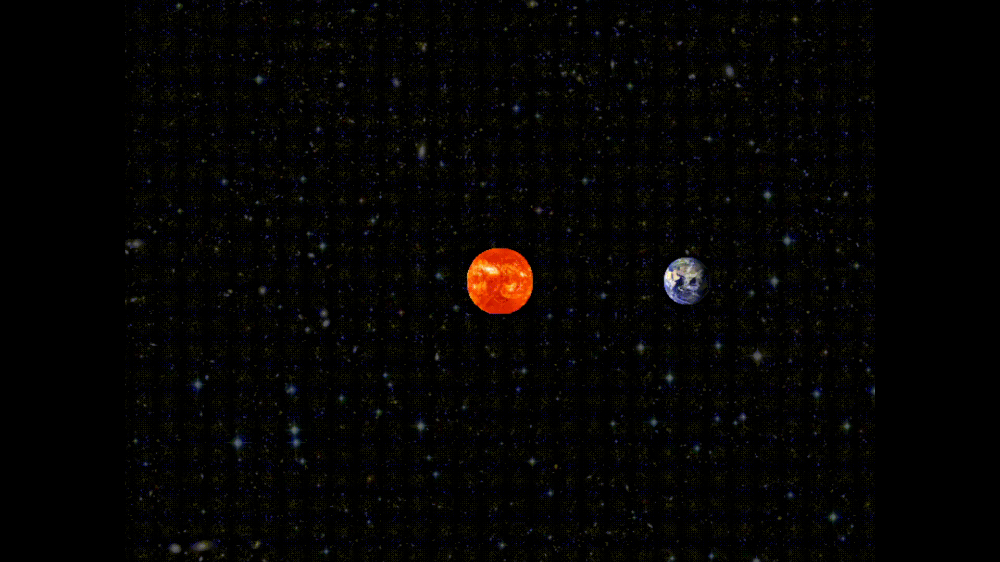
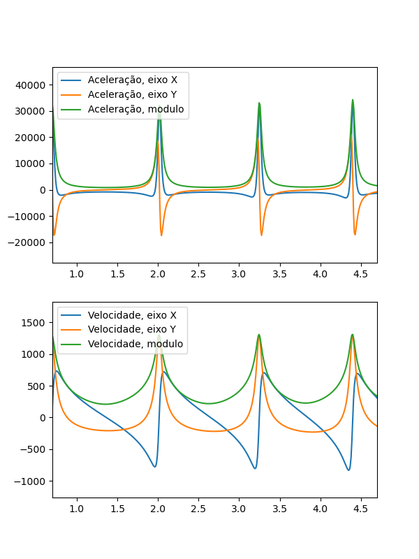
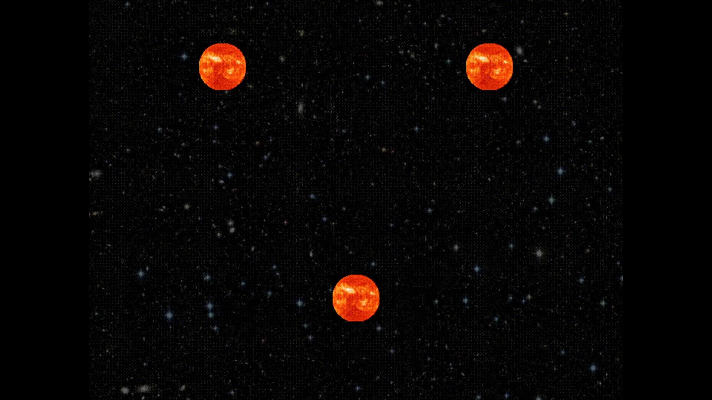
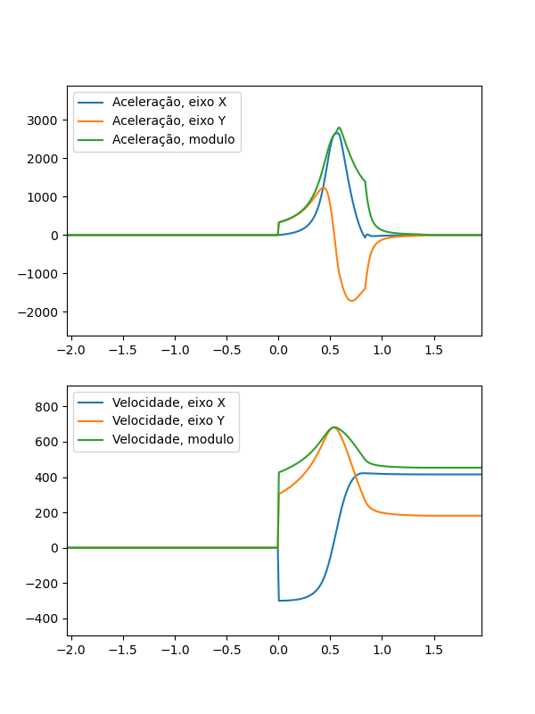
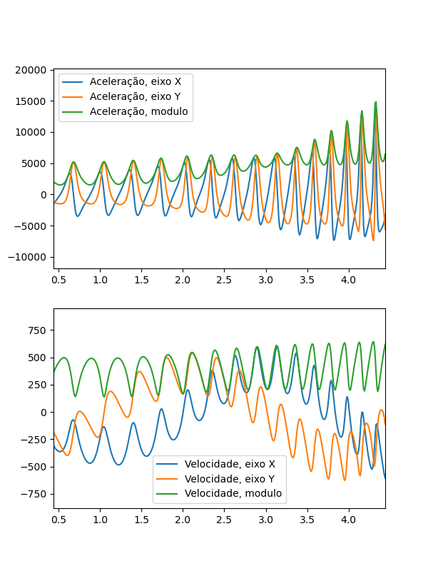

# Simulação de Gravidade em python
 Este programa utiliza as bibliotecas Pyglet e Matplotlib para realizar simulações de sistemas gravitacionais em 2D. Nele se é possível criar n corpos no espaço e definir suas velocidades e direções iniciais. Após isso, a simulação está pronta para ser iniciada, será possível observar a interação que os planetas tem entre si e também um gráfico contendo a velocidade e aceleração dos corpos. É também possível rodar configurações pré-definidas.

## Como usar o Simulador
1. Iniciar o programa:
  - Abra o script `main.py` com o python: `python main.py`
  - Você pode passar um número como argumento para escolher a configuração pré-definida: `python main.py 1`
2. Adicionar corpos:
  - Clique na tela com o botão esquerdo para adicionar um corpo.
  - Ainda segurando o botão esquerdo araste o mouse para definir a direção e a velocidade inicial do corpo.
  - Depois de soltar o botão esquerdo, aperte as teclas 1, 2, 3 para mudar o corpo para Lua, Terra e Sol, respectivamente.
  - Repita até preparar o estado inicial da simulação.
3. Iniciar a simulação:
  - Após já ter adicionado um corpo com sua direção e velocidade basta apenas apertar Enter e observar a simulação.
  - Para resetar a simulação, aperte R.
  
## Simulações

Foram feitas as seguintes simulações:

1. Sistema de orbita circular Terra e Sol.

2. Sistema de orbita circular Lua e Terra.

3. Sistema de orbita eliptica Terra e Sol.

4. Colisão de dois corpos inicialmente parados.

5. Sistema de três corpos em posições simétricas (triângulo equilátero) e com velocidades similares.

6. Sistema Sol, Terra, Lua.

## Análise física

A física por trás da simulação é baseada na Lei da Gravitação Universal prosposta por Isaac Newton, onde a aceleração de cada corpo é calculada considerando as forças gravitacionais que ele sente devido a presença dos outros corpos no sistema.

A aceleração de um corpo A sendo atraído por um corpo B é dada pela seguinte fórmula:

onde: G é Constante gravitacional, M é a massa do corpo B, o vetor r (com a seta) é a o vetor da posição do corpo A com origem no corpo B, e r (sem a seta) é módulo do vetor r.

Essa fórmula é mais simples de se calcular no programa, visto que não é necessário o vetor unitário de direção da força (pois este é obtido dividindo o vetor r por seu módulo, e daí vem o expoente 3 ao invés do expoente 2 que é normalmente visto).

Para a velocidade obtivemo-a através da EDO:

E a posição é obtida através da EDO:

Para as duas primeiras simulações, foi utilizado a seguinte fórmula para velocidade de órbita:

Garantindo uma órbita (quase) perfeitamente circular.

Na primeira simulação, podemos observar pelo gráfico abaixo que tanto a aceleração quanto a velocidade se mantiveram constante (aproximadamente, visto que o Sol não era perfeitamente estático), e que as projeções nos eixo X e Y seguem curvas senoidais. Isso segue exatamente as previsões feitas pelas fórmulas físicas.

Na terceira simulação, é possível observar a primeira lei de Kepler, a terra segue uma órbita eliptica, com o sol em um dos focos:

Foram calculados os períodos de órbita e seus semieixos maiores para aplicar a terceira lei de Kepler.

Para obter o período (T), basta calcular a distância de cada pico de aceleração/velocidade da elipse, que corresponde ao periélio:

Já para o semieixo maior (R), bastou somar a distância ao sol no periélio e no afélio e dividir por 2.

Foram obtidos os seguintes resultados para a primeira e terceira simulação:

1. T = 3.1, R = 200, R³/T² = 8.3 * 10⁵
2. T = 1.2, R = 108 ,R³/T² = 8.7 * 10⁵

Que são aproxidamente iguais, como previsto pela terceira lei de kepler.

Na quinta simulação, podemos observar comportamento caótico num sistema de três corpos:

Por fim, foi feita uma simulação de três corpos com o Sol, a Terra e a Lua:

Fazendo o gráfico de aceleração/velocidade da lua, podemos observar um tendência interessante: Por conta das contribuições de rotação do Sol (período longo) quanto da Terra (período curto), a velocidade da lua se aproxima de duas senoidais, uma de período longo e outra curta:

